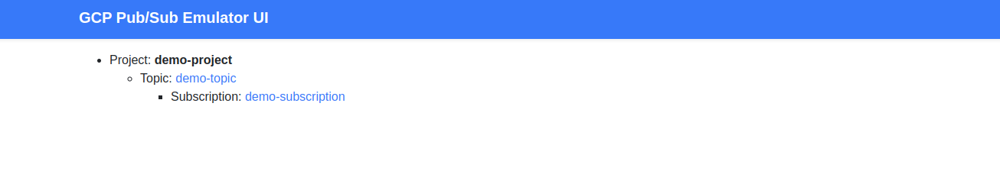
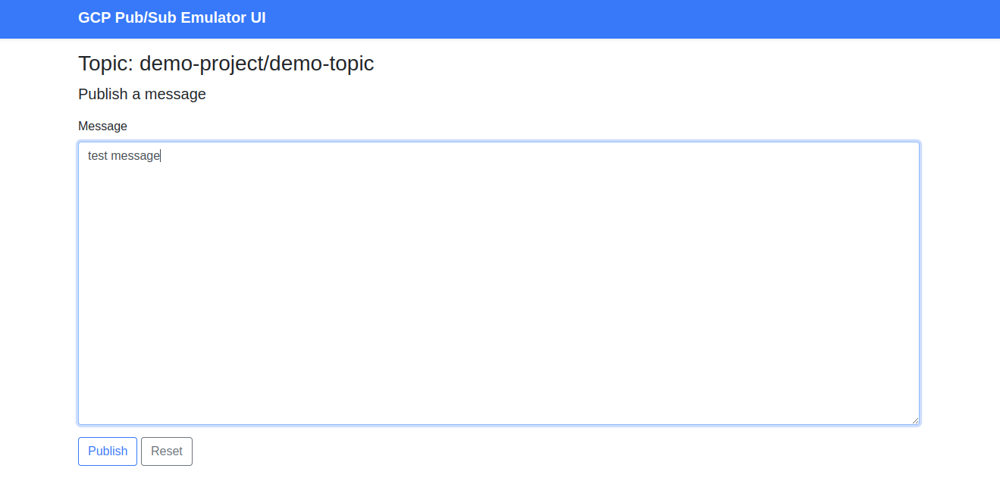

# :material-school-outline: Worker application tutorial

> How to build, step by step, a worker application with Yokai.

## Overview

In this tutorial, we will create a worker application subscribing to [Pub/Sub](https://cloud.google.com/pubsub).

You can find a complete implementation in
the [worker application demo](../../applications/demos#worker-application-demo).

## Application setup

In this tutorial, we will create our application in the `github.com/foo/bar` example repository.

### Repository creation

To create your `github.com/foo/bar` repository, you can use
the [worker application template](../../applications/templates#worker-application-template).

It provides:

- a ready to extend Yokai application, with the [fxworker](https://github.com/ankorstore/yokai/tree/main/fxworker)
  module installed
- a ready to use [dev environment](https://github.com/ankorstore/yokai-http-template/blob/main/docker-compose.yaml),
  based on [Air](https://github.com/cosmtrek/air) (for live reloading)

### Repository content

Once your repository is created, you should have the following the content:

- `cmd/`: entry points
- `configs/`: configuration files
- `internal/`:
	- `worker/`: worker and test examples
	- `bootstrap.go`: bootstrap (modules, lifecycles, etc)
	- `services.go`: dependency injection

And a `Makefile`:

```
make up     # start the docker compose stack
make down   # stop the docker compose stack
make logs   # stream the docker compose stack logs
make fresh  # refresh the docker compose stack
make test   # run tests
make lint   # run linter
```

## Application discovery

You can start your application by running:

```shell
make fresh
```

After a short time, the application will expose the application core dashboard
on [http://localhost:8081](http://localhost:8081).

### Example worker

When you use the template,
an [example worker ](https://github.com/ankorstore/yokai-worker-template/blob/main/internal/worker/example.go)is
provided.

It logs periodically the message `running`, and the interval can be configured in `configs/config.yaml`:

```yaml title="configs/config.yaml"
config:
  example-worker:
    interval: 3
```

You can run `make logs` to see it in action:

```shell
INF running module=worker service=worker-app worker=example-worker workerExecutionID=346775a2-6be5-43c3-907f-100a986cb2dc
```

To ease development, [Air](https://github.com/cosmtrek/air) is watching any changes you perform on `Go code`
or `config files` to perform hot reload.

Let's change:

- the application name to `pubsub-worker` in `app.name`
- the worker interval to `1` in `config.example-worker.interval`

```yaml title="config/config.yaml"
app:
  name: pubsub-worker
config:
  example-worker:
    interval: 1
```

You can observe the logs again with `make logs` to see the change hot reloaded.

### Core dashboard

Yokai is providing a core dashboard on [http://localhost:8081](http://localhost:8081):


From there, you can get:

- an overview of your application
- information and tooling about your application: build, config, metrics, pprof, etc.
- access to the configured health check endpoints
- access to the loaded modules information (when exposed)

Here we can see for example the [fxworker](../modules/fxworker.md) information in the `Modules` section:

- active workers
- their events
- and their status

See [fxcore](../modules/fxcore.md) documentation for more information.

## Application implementation

Let's start your application implementation, by:

- adding Pub/Sub support
- implementing a worker to subscribe to Pub/Sub

### Pub/Sub setup

#### Pub/Sub installation

Let's update your `docker-compose.yaml` to add to your stack:

- a [Pub/Sub emulator](https://hub.docker.com/r/messagebird/gcloud-pubsub-emulator) container
- a [Pub/Sub UI](https://hub.docker.com/r/echocode/gcp-pubsub-emulator-ui) container, working with the emulator

```yaml title="docker-compose.yaml"
version: '3.9'

services:
  pubsub-worker:
    build:
      dockerfile: dev.Dockerfile
      context: .
    networks:
      - pubsub-worker-network
    ports:
      - "8081:8081"
    expose:
      - "8081"
    volumes:
      - .:/app
    env_file:
      - .env

  pubsub-worker-pubsub:
    container_name: pubsub-worker-pubsub
    image: messagebird/gcloud-pubsub-emulator:latest
    networks:
      - pubsub-worker-network
    ports:
      - "8681:8681"
    env_file:
      - .env
    environment:
      - PUBSUB_PROJECT1=${PUBSUB_PROJECT_ID:-demo-project},${PUBSUB_TOPIC_ID:-demo-topic}:${PUBSUB_SUBSCRIPTION_ID:-demo-subscription}

  pubsub-worker-pubsub-ui:
    container_name: pubsub-worker-pubsub-ui
    image: echocode/gcp-pubsub-emulator-ui:latest
    networks:
      - pubsub-worker-network
    ports:
      - "8680:8680"
    expose:
      - "8680"
    env_file:
      - .env
    environment:
      - PUBSUB_EMULATOR_HOST=${PUBSUB_EMULATOR_HOST:-pubsub-worker-pubsub:8681}
      - GCP_PROJECT_IDS=${PUBSUB_PROJECT_ID:-demo-project}

networks:
  pubsub-worker-network:
    driver: bridge
```

And the configuration in your `.env` file:

```env title=".env"
APP_ENV=dev
APP_DEBUG=true
PUBSUB_PROJECT_ID=demo-project
PUBSUB_TOPIC_ID=demo-topic
PUBSUB_SUBSCRIPTION_ID=demo-subscription
PUBSUB_EMULATOR_HOST=pubsub-worker-pubsub:8681
```

You can then refresh your stack to bring this up:

```shell
make fresh
```

This will start the Pub/Sub emulator, with:

- the `demo-project` project ID
- auto creation of the `demo-topic` topic
- auto creation of the `demo-subscription` subscription

You can check that everything is set up by accessing the Pub/Sub UI on [http://localhost:8680](http://localhost:8680/):



#### Pub/Sub module creation

Yokai provides the possibility to create modules to extend your application.

Let's create a very simple one to provide a [Pub/Sub client](https://pkg.go.dev/cloud.google.com/go/pubsub) to your
application.

You can create it in `internal/module/fxpubsub/module.go`:

```go title="internal/module/fxpubsub/module.go"
package fxpubsub

import (
	"context"
	"fmt"

	"cloud.google.com/go/pubsub"
	"github.com/ankorstore/yokai/config"
	"go.uber.org/fx"
)

const ModuleName = "pubsub"

var FxPubSubModule = fx.Module(
	ModuleName,
	fx.Provide(
		NewFxPubSub,
	),
)

type FxPubSubParam struct {
	fx.In
	LifeCycle fx.Lifecycle
	Config    *config.Config
}

func NewFxPubSub(p FxPubSubParam) (*pubsub.Client, error) {
	return createClient(context.Background(), p.LifeCycle, p.Config)
}

func createClient(ctx context.Context, lc fx.Lifecycle, config *config.Config) (*pubsub.Client, error) {
	// client
	client, err := pubsub.NewClient(ctx, config.GetString("modules.pubsub.project"))
	if err != nil {
		return nil, fmt.Errorf("failed to create pubsub client: %w", err)
	}

	// lifecycle
	lc.Append(fx.Hook{
		// close on stop the client
		OnStop: func(ctx context.Context) error {
			return client.Close()
		},
	})

	return client, nil
}
```

This will:

- provide a `*pubsub.Client` in Yokai dependency injection system, configurable from your application configuration
  files
- and hook on application lifecycles to shut down the client when the application stops

You can then activate it in your application bootstrapper:

```go title="internal/bootstrap.go"
package internal

import (
	"github.com/ankorstore/yokai/fxcore"
	"github.com/foo/bar/internal/module/fxpubsub"
)

// ...

var Bootstrapper = fxcore.NewBootstrapper().WithOptions(
	// load fxpubsub module
	fxpubsub.FxPubSubModule,
	// ...
)
```

You can then provide the module configuration:

```yaml title="configs/config.yaml"
modules:
  pubsub:
    project: ${PUBSUB_PROJECT_ID}
    topic: ${PUBSUB_TOPIC_ID}
    subscription: ${PUBSUB_SUBSCRIPTION_ID}
    emulator: ${PUBSUB_EMULATOR_HOST}
```

You can check the [fxconfig](../modules/fxconfig.md#env-var-placeholders) documentation to get more details about the
configuration env var placeholders.

### Worker implementation

We can create a `SubscribeWorker` to subscribe to the `demo-subscription` subscription:

```go title="internal/worker/subscribe.go"
package worker

import (
	"context"

	"cloud.google.com/go/pubsub"
	"github.com/ankorstore/yokai/config"
	"github.com/ankorstore/yokai/log"
)

type SubscribeWorker struct {
	config *config.Config
	client *pubsub.Client
}

func NewSubscribeWorker(config *config.Config, client *pubsub.Client) *SubscribeWorker {
	return &SubscribeWorker{
		config: config,
		client: client,
	}
}

func (w *SubscribeWorker) Name() string {
	return "subscribe-worker"
}

func (w *SubscribeWorker) Run(ctx context.Context) error {
	subscription := w.client.Subscription(w.config.GetString("modules.pubsub.subscription"))

	return subscription.Receive(ctx, func(c context.Context, msg *pubsub.Message) {
		log.CtxLogger(c).Info().Msgf(
			"received message: id=%v, data=%v",
			msg.ID,
			string(msg.Data),
		)

		msg.Ack()
	})
}
```

We then need to register the worker in `internal/services.go` with `fxworker.AsWorker()`:

```go title="internal/services.go"
package internal

import (
	"github.com/ankorstore/yokai/fxworker"
	"github.com/foo/bar/internal/worker"
	"go.uber.org/fx"
)

func ProvideServices() fx.Option {
	return fx.Options(
		// ...
		fxworker.AsWorker(worker.NewSubscribeWorker),
	)
}

```

This will:

- automatically inject the `*config.Config` and the `*pubsub.Client` in the `SubscribeWorker` constructor
- and make the `SubscribeWorker` collected by the [fxworker](../modules/fxworker.md) workers pool

### Message publication

Let's first refresh your stack by running `make fresh`.

You can check in your [application core dashboard](http://localhost:8081) that the worker is properly running:


You can open your browser on [http://localhost:8680/project/demo-project/topic/demo-topic](http://localhost:8680/project/demo-project/topic/demo-topic):



And use the [Pub/Sub UI](http://localhost:8680/) to publish a `test message`.

You can check your application logs with `make logs`, and you should see the worker in action:

```
INF received message: id=1, data=test message module=worker service=pubsub-worker worker=subscribe-worker
```

## Application observability

At this stage, your application is able to subscribe to Pub/Sub.

To provide a better understanding of what is happening at runtime, let's instrument it with:

- logs
- traces
- metrics

### Application logging

With Yokai, `logging` is `contextual`.

This means that you should [propagate the context](https://go.dev/blog/context) and retrieve
the [logger](../modules/fxlog.md#usage) from it in order to produce `correlated` logs.

The [fxworker](../modules/fxworker.md#logging) module automatically injects a logger in the context provided to workers.

Let's add more logs to our `SubscribeWorker` with `log.CtxLogger()`:

```go title="internal/worker/subscribe.go"
package worker

import (
	"context"

	"cloud.google.com/go/pubsub"
	"github.com/ankorstore/yokai/config"
	"github.com/ankorstore/yokai/log"
)

type SubscribeWorker struct {
	config *config.Config
	client *pubsub.Client
}

func NewSubscribeWorker(config *config.Config, client *pubsub.Client) *SubscribeWorker {
	return &SubscribeWorker{
		config: config,
		client: client,
	}
}

func (w *SubscribeWorker) Name() string {
	return "subscribe-worker"
}

func (w *SubscribeWorker) Run(ctx context.Context) error {
	subscription := w.client.Subscription(w.config.GetString("modules.pubsub.subscription"))

	return subscription.Receive(ctx, func(c context.Context, msg *pubsub.Message) {
		logger := log.CtxLogger(c)

		logger.Info().Msgf("in %s", w.Name())

		logger.Info().Msgf(
			"received message: id=%v, data=%v",
			msg.ID,
			string(msg.Data),
		)

		msg.Ack()
	})
}
```

If you [publish another message](http://localhost:8680/project/demo-project/topic/demo-topic) while observing the logs with `make logs`, you should see:

```shell
INF in subscribe-worker module=worker service=pubsub-worker worker=subscribe-worker workerExecutionID=fd2fd994-bc7a-4715-9d12-0b8075acb74a
INF received message: id=2, data=test message module=worker service=pubsub-worker worker=subscribe-worker workerExecutionID=fd2fd994-bc7a-4715-9d12-0b8075acb74a
```

You can see that:

- logs are automatically extended with the `worker` field, to know which worker produced them
- logs are automatically correlated by `workerExecutionID`, allowing you to understand what happened in a specific worker execution


You can get more information about workers logging in the [fxworker](../modules/fxworker.md#logging) documentation.

### Application tracing

With Yokai, `tracing` is `contextual`.

This means that you should [propagate the context](https://go.dev/blog/context) and retrieve
the [tracer provider](../modules/fxtrace.md#usage) from it in order to produce `correlated` trace spans.

The [fxworker](../modules/fxworker.md#tracing) module automatically injects the tracer provider in the context
provided to workers.

First let's activate the [fxtrace](../modules/fxtrace.md#configuration) exporter to `stdout`:

```yaml title="configs/config.yaml"
modules:
  trace:
    processor: stdout
```

Let's then add trace spans to our `SubscribeWorker` with `trace.CtxTracerProvider()`:

```go title="internal/worker/subscribe.go"
package worker

import (
	"context"
	"fmt"

	"cloud.google.com/go/pubsub"
	"github.com/ankorstore/yokai/config"
	"github.com/ankorstore/yokai/log"
	"github.com/ankorstore/yokai/trace"
)

type SubscribeWorker struct {
	config *config.Config
	client *pubsub.Client
}

func NewSubscribeWorker(config *config.Config, client *pubsub.Client) *SubscribeWorker {
	return &SubscribeWorker{
		config: config,
		client: client,
	}
}

func (w *SubscribeWorker) Name() string {
	return "subscribe-worker"
}

func (w *SubscribeWorker) Run(ctx context.Context) error {
	subscription := w.client.Subscription(w.config.GetString("modules.pubsub.subscription"))

	return subscription.Receive(ctx, func(c context.Context, msg *pubsub.Message) {
		c, span := trace.CtxTracerProvider(c).Tracer(w.Name()).Start(c, fmt.Sprintf("%s span", w.Name()))
		defer span.End()

		logger := log.CtxLogger(c)

		logger.Info().Msgf("in %s", w.Name())

		logger.Info().Msgf(
			"received message: id=%v, data=%v",
			msg.ID,
			string(msg.Data),
		)

		msg.Ack()
	})
}
```

If you [publish another message](http://localhost:8680/project/demo-project/topic/demo-topic) while observing the logs with `make logs`, you should see:

```
// logs
INF received message: id=3, data=test message module=worker service=pubsub-worker spanID=0fa9c8043ea50abe traceID=6be5177482b1386fefe40ef756ee61fa worker=subscribe-worker workerExecutionID=9be1a627-ecc5-4626-b0a5-891ab86b4de7
INF in subscribe-worker module=worker service=pubsub-worker spanID=0fa9c8043ea50abe traceID=6be5177482b1386fefe40ef756ee61fa worker=subscribe-worker workerExecutionID=9be1a627-ecc5-4626-b0a5-891ab86b4de7

// trace span
{"Name":"subscribe-worker span","SpanContext":{"TraceID":"6be5177482b1386fefe40ef756ee61fa","SpanID":"0fa9c8043ea50abe","TraceFlags":"01","TraceState":"","Remote":false},"Parent":{"TraceID":"00000000000000000000000000000000","SpanID":"0000000000000000","TraceFlags":"00","TraceState":"","Remote":false},"SpanKind":1,"StartTime":"2024-02-08T10:46:14.807695672Z","EndTime":"2024-02-08T10:46:14.807857105Z","Attributes":[{"Key":"Worker","Value":{"Type":"STRING","Value":"subscribe-worker"}},{"Key":"WorkerExecutionID","Value":{"Type":"STRING","Value":"9be1a627-ecc5-4626-b0a5-891ab86b4de7"}}],"Events":null,"Links":null,"Status":{"Code":"Unset","Description":""},"DroppedAttributes":0,"DroppedEvents":0,"DroppedLinks":0,"ChildSpanCount":0,"Resource":[{"Key":"service.name","Value":{"Type":"STRING","Value":"pubsub-worker"}}],"InstrumentationLibrary":{"Name":"subscribe-worker","Version":"","SchemaURL":""}}
```

Here, we can see on logs side, that:

- they are still correlated by `workerExecutionID`
- but they also have the `traceID` and `spanID` fields, correlating logs and trace spans

And on trace span side, that:

- it is correlated by `TraceID`
- it contains the `Worker` attribute matching the worker name 
- it contains the `WorkerExecutionID` attribute matching the logs `workerExecutionID`

You can get more information about workers tracing in the [fxworker](../modules/fxworker.md#tracing) documentation.

### Application metrics

Yokai, via the [fxmetrics](../modules/fxmetrics.md) module, is collecting and exposing automatically metrics.

The core HTTP server of your application will expose them by default
on [http://localhost:8081/metrics](http://localhost:8081/metrics), but you can also see them on
your [core dashboard](http://localhost:8081):


You can see that, by default, the [fxworker](../modules/fxworker.md#metrics) module automatically collects execution metrics on your workers.

Let's now add an example custom metric in our `SubscribeWorker` to count the number of received messages:

```go title="internal/worker/subscribe.go"
package worker

import (
	"context"
	"fmt"

	"cloud.google.com/go/pubsub"
	"github.com/ankorstore/yokai/config"
	"github.com/ankorstore/yokai/log"
	"github.com/ankorstore/yokai/trace"
	"github.com/prometheus/client_golang/prometheus"
)

var SubscribeCounter = prometheus.NewCounter(prometheus.CounterOpts{
	Name: "messages_received_total",
	Help: "Total number of received messages",
})

type SubscribeWorker struct {
	config *config.Config
	client *pubsub.Client
}

func NewSubscribeWorker(config *config.Config, client *pubsub.Client) *SubscribeWorker {
	return &SubscribeWorker{
		config: config,
		client: client,
	}
}

func (w *SubscribeWorker) Name() string {
	return "subscribe-worker"
}

func (w *SubscribeWorker) Run(ctx context.Context) error {
	subscription := w.client.Subscription(w.config.GetString("modules.pubsub.subscription"))

	return subscription.Receive(ctx, func(c context.Context, msg *pubsub.Message) {
		c, span := trace.CtxTracerProvider(c).Tracer(w.Name()).Start(c, fmt.Sprintf("%s span", w.Name()))
		defer span.End()

		logger := log.CtxLogger(c)

		logger.Info().Msgf("in %s", w.Name())

		logger.Info().Msgf(
			"received message: id=%v, data=%v",
			msg.ID,
			string(msg.Data),
		)

		msg.Ack()

		SubscribeCounter.Inc()
	})
}
```

To collect this metric, we need to register it with `fxmetrics.AsMetricsCollector()` in `internal/services.go`:

```go title="internal/services.go"
package internal

import (
	"github.com/ankorstore/yokai/fxmetrics"
	"github.com/ankorstore/yokai/fxworker"
	"github.com/foo/bar/internal/worker"
	"go.uber.org/fx"
)

func ProvideServices() fx.Option {
	return fx.Options(
		// workers
		fxworker.AsWorker(worker.NewExampleWorker),
		fxworker.AsWorker(worker.NewSubscribeWorker),
		// metrics
		fxmetrics.AsMetricsCollector(worker.SubscribeCounter),
	)
}

```

If you [publish another message](http://localhost:8680/project/demo-project/topic/demo-topic), you can then check the metrics on
the [core metrics endpoint](http://localhost:8081/metrics):

```shell title="[GET] http://localhost:8081/metrics"
# ...
# HELP messages_received_total Total number of received messages
# TYPE messages_received_total counter
messages_received_total 1
```

## Application testing

At this stage, we are able to subscribe to Pub/Sub, and we have observability signals to monitor this.

The next step is to provide tests for your application, to ensure it's behaving as expected.

### Tests configuration

Yokai's [bootstrapper](../modules/fxcore.md#bootstrap) provides a `RunTest()` function to start your application
in `test` mode.

This will automatically set the env var `APP_ENV=test`, and
will [load your test configuration](../modules/fxconfig.md#dynamic-env-overrides).

For our tests, we can configure:

- the [fxlog](../modules/fxlog.md#testing) module to send logs to a `test buffer`
- the [fxtrace](../modules/fxtrace.md#testing) module to send trace spans to a `test exporter`
- the fxpubsub module project, topic and subscription to use

Let's set the testing configuration in `config/config.test.yaml` and activate the `debug`:

```yaml title="config/config.test.yaml"
app:
  debug: true
modules:
  log:
    level: debug
    output: test
  trace:
    processor:
      type: test
  pubsub:
    project: test-project
    topic: test-topic
    subscription: test-subscription
```

### Tests preparation

We created a `fxpubsub` module, making available a Pub/Sub client in our application dependency injection system.

But this means we need a Pub/Sub instance to use it, even in test mode, which is not making our test portable (Pub/Sub dependency).

Let's adapt our module to provide, in test mode, a client using a connection to a [test server](https://pkg.go.dev/cloud.google.com/go/pubsub/pstest):

```go title="internal/module/fxpubsub/module.go"
package fxpubsub

import (
	"context"
	"fmt"
	"time"

	"cloud.google.com/go/pubsub"
	"cloud.google.com/go/pubsub/pstest"
	"github.com/ankorstore/yokai/config"
	"go.uber.org/fx"
	"google.golang.org/api/option"
	"google.golang.org/grpc"
	"google.golang.org/grpc/credentials/insecure"
)

const ModuleName = "pubsub"

var FxPubSubModule = fx.Module(
	ModuleName,
	fx.Provide(
		NewFxPubSub,
	),
)

type FxPubSubParam struct {
	fx.In
	LifeCycle fx.Lifecycle
	Config    *config.Config
}

func NewFxPubSub(p FxPubSubParam) (*pubsub.Client, error) {
	ctx := context.Background()

	if p.Config.IsTestEnv() {
		return createTestClient(ctx, p.LifeCycle, p.Config)
	} else {
		return createClient(ctx, p.LifeCycle, p.Config)
	}
}

func createClient(ctx context.Context, lc fx.Lifecycle, config *config.Config) (*pubsub.Client, error) {
	// client
	client, err := pubsub.NewClient(ctx, config.GetString("modules.pubsub.project"))
	if err != nil {
		return nil, fmt.Errorf("failed to create pubsub client: %w", err)
	}

	// lifecycle
	lc.Append(fx.Hook{
		// close on stop the client
		OnStop: func(ctx context.Context) error {
			return client.Close()
		},
	})

	return client, nil
}

func createTestClient(ctx context.Context, lc fx.Lifecycle, config *config.Config) (*pubsub.Client, error) {
	// test server
	srv := pstest.NewServer()

	conn, err := grpc.Dial(srv.Addr, grpc.WithTransportCredentials(insecure.NewCredentials()))
	if err != nil {
		return nil, err
	}

	// test client
	client, err := pubsub.NewClient(ctx, config.GetString("modules.pubsub.project"), option.WithGRPCConn(conn))
	if err != nil {
		return nil, fmt.Errorf("failed to create test pubsub client: %w", err)
	}

	// lifecycle
	lc.Append(fx.Hook{
		// create on start the tests topic and subscription
		OnStart: func(ctx context.Context) error {
			// test topic
			topicName := config.GetString("modules.pubsub.topic")
			topic := client.Topic(topicName)

			topicExists, err := topic.Exists(ctx)
			if err != nil {
				return fmt.Errorf("cannot check if topic %s exist: %w", topicName, err)
			}

			if !topicExists {
				topic, err = client.CreateTopic(ctx, topicName)
				if err != nil {
					return fmt.Errorf("cannot create topic %s: %w", topicName, err)
				}
			}

			// test subscription
			subscriptionName := config.GetString("modules.pubsub.subscription")
			subscription := client.Subscription(subscriptionName)

			subscriptionExists, err := subscription.Exists(ctx)
			if err != nil {
				return fmt.Errorf("cannot check if subscription %s exist: %w", subscriptionName, err)
			}

			if !subscriptionExists {
				_, err = client.CreateSubscription(
					ctx,
					subscriptionName,
					pubsub.SubscriptionConfig{
						Topic:       topic,
						AckDeadline: 10 * time.Second,
					},
				)
				if err != nil {
					return fmt.Errorf("cannot create subscription %s: %w", subscriptionName, err)
				}
			}

			return nil
		},
		// close on stop the client and the test server
		OnStop: func(ctx context.Context) error {
			err = client.Close()
			if err != nil {
				return err
			}

			return srv.Close()
		},
	})

	return client, nil
}
```

This will:

- still provide a `*pubsub.Client`, and hook on application lifecycles to shut down the client when the application stops
- but also provide, in test mode, a `*pubsub.Client` using a connection to a test server, and hook on application lifecycles:
  	- to create test topic and subscription when the application starts on test mode
  	- to shut down the client and the test server when the application stops on test mode

### Tests implementation

We can now provide `functional` tests for your worker.

Let's create our `TestSubscribeWorker` test in the `worker_test` package:

```go title="internal/worker/subscribe_test.go"
package worker_test

import (
	"context"
	"fmt"
	"strings"
	"testing"
	"time"

	"cloud.google.com/go/pubsub"
	"github.com/ankorstore/yokai/log/logtest"
	"github.com/ankorstore/yokai/trace/tracetest"
	"github.com/foo/bar/internal"
	"github.com/prometheus/client_golang/prometheus"
	"github.com/prometheus/client_golang/prometheus/testutil"
	"github.com/stretchr/testify/assert"
	"go.opentelemetry.io/otel/attribute"
	"go.uber.org/fx"
)

func TestSubscribeWorker(t *testing.T) {
	ctx := context.Background()

	testMessage := "test message"

	// env vars
	t.Setenv("APP_CONFIG_PATH", fmt.Sprintf("%s/configs", internal.RootDir))

	var client *pubsub.Client
	var logBuffer logtest.TestLogBuffer
	var traceExporter tracetest.TestTraceExporter
	var metricsRegistry *prometheus.Registry

	// bootstrap test app
	app := internal.Bootstrapper.BootstrapTestApp(
		t,
		fx.Populate(
			&client,
			&logBuffer,
			&traceExporter,
			&metricsRegistry,
		),
	)

	// start test app
	app.RequireStart()

	// publish test message
	result := client.Topic("test-topic").Publish(ctx, &pubsub.Message{
		Data: []byte(testMessage),
	})

	id, err := result.Get(ctx)
	assert.NoError(t, err)

	// stop test app (after 1 sec wait to avoid test flakiness)
	time.Sleep(1 * time.Second)

	app.RequireStop()

	// logs assertion
	logtest.AssertHasLogRecord(t, logBuffer, map[string]interface{}{
		"level":   "info",
		"service": "pubsub-worker",
		"module":  "worker",
		"worker":  "subscribe-worker",
		"message": "in subscribe-worker",
	})

	logtest.AssertHasLogRecord(t, logBuffer, map[string]interface{}{
		"level":   "info",
		"service": "pubsub-worker",
		"module":  "worker",
		"worker":  "subscribe-worker",
		"message": fmt.Sprintf("received message: id=%v, data=%s", id, testMessage),
	})

	// trace assertion
	tracetest.AssertHasTraceSpan(
		t,
		traceExporter,
		"subscribe-worker span",
		attribute.String("Worker", "subscribe-worker"),
	)

	// metrics assertion
	expectedMetric := `
		# HELP messages_received_total Total number of received messages
		# TYPE messages_received_total counter
		messages_received_total 1
	`

	err = testutil.GatherAndCompare(
		metricsRegistry,
		strings.NewReader(expectedMetric),
		"messages_received_total",
	)
	assert.NoError(t, err)
}
```

In this functional test:

- we start the application in test mode
- we use the Pub/Sub client to publish a message on the test server
- we assert on the worker logs to ensure it got the message
- we assert on the observability signals (logs, traces and metrics)

You can then run `make test`:

```shell
=== RUN   TestSubscribeWorker
--- PASS: TestSubscribeWorker (0.00s)
PASS
```

This tutorial will only cover testing of the `SubscribeWorker` as example, you need to provide other `functional`
tests and the classic `unit` and `integration` tests for the rest of your application.

Thanks to Yokai's [dependency injection system](../modules/fxcore.md#dependency-injection)
and [testing tools](../modules/fxcore.md#testing), it's easy to provide mocks as dependencies for your implementations.
